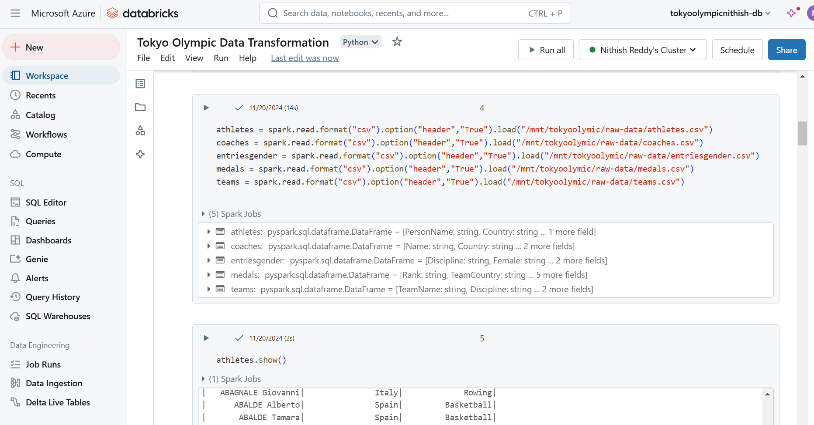

# Tokyo 2021 Olympics Dataset ETL Pipeline with Azure Services

## 📖 Project Overview  
This project demonstrates an **end-to-end ETL pipeline** built using Microsoft Azure services to process and analyze the Tokyo 2021 Olympics dataset. The primary goal is to gain hands-on experience with Azure tools by integrating services for data ingestion, storage, transformation, and visualization. While the project is a learning exercise, it provides a foundational framework for scalable and efficient data operations.

---

## 📊 Dataset  
The dataset consists of five CSV files related to the Tokyo 2021 Olympics:  
- **Athletes**: Details of athletes participating in the Olympics.  
- **Coaches**: Information about the coaches for various teams and events.  
- **EntriesGender**: Gender-wise breakdown of participants.  
- **Medals**: Details of medal winners by event and country.  
- **Teams**: Information about participating teams.  

---

## 🔧 Azure Services Used  

### 1. **Azure Data Factory (ADF)**  
- Cloud-based ETL service used for **data ingestion**.  
- Pipelines copied raw data from GitHub to Azure Data Lake Storage Gen2 (ADLS Gen2).

### 2. **Azure Data Lake Storage Gen2 (ADLS Gen2)**  
- Centralized storage for raw and transformed data.  
- Data organized into two folders: `raw-data` and `transformed-data`.

### 3. **Azure Databricks**  
- Analytics platform based on Apache Spark, used for **data transformation**.  
- Performed tasks such as schema validation, data cleaning, and writing transformed data back to ADLS Gen2.

### 4. **Azure Synapse Analytics**  
- Data warehousing service used for creating tables and querying transformed data.  
- Data was fetched from ADLS Gen2 into a SQL pool for organized storage and analysis.

### 5. **Power BI**  
- Business intelligence tool used for **data visualization**.  
- Integration with Synapse Analytics was initiated to build dashboards (I haven't done this as it is out of Data-Engineering scope).

---

## 🛠️ ETL Process  

1. **Data Ingestion**  
   - Raw data was copied from a GitHub repository using ADF pipelines.  
   - Data was stored in the `raw-data` folder in ADLS Gen2.

2. **Data Transformation**  
   - Data was processed in Azure Databricks using PySpark:  
     - Loaded CSV files into DataFrames.  
     - Performed schema validation and cleaned missing values.  
     - Transformed data was written to the `transformed-data` folder in ADLS Gen2.

3. **Data Warehousing**  
   - Transformed data was linked to Azure Synapse Analytics.  
   - Tables were created in a SQL pool for querying and analysis.
     

4. **Visualization (In Progress)**  
   - Power BI integration was initiated for interactive dashboard creation.  
   - Reports will focus on insights like medal distributions, gender-wise participation, and team performances.

---

## ✨ Key Features  
- **Seamless Integration**: Utilizes Azure services for a cohesive pipeline.  
- **Scalability**: Leverages ADLS Gen2 and Synapse Analytics for handling large datasets.  
- **Advanced Transformation**: PySpark in Databricks ensures efficient data processing.  
- **Analytics-Ready Data**: Structured data ready for immediate querying and visualization.

---

## 🚀 How to Use This Repository  

### **Prerequisites**  
- An active **Microsoft Azure account**.  
- Familiarity with Azure Data Factory, ADLS Gen2, Databricks, Synapse Analytics, and Power BI.  
- Access to the Tokyo 2021 Olympics dataset.

### **Steps to Recreate the Project**  
1. Clone this repository.  
2. Set up Azure resources following the ETL pipeline steps provided in this repository.  
3. Use the provided PySpark code for data transformation in Azure Databricks.  
4. Link transformed data to Azure Synapse Analytics.  
5. (Optional) Create dashboards in Power BI for data visualization.

---

## 🔍 Potential Improvements  

### **Production-Grade Enhancements**  
- Add robust logging and monitoring in ADF pipelines.  
- Implement security measures like Role-Based Access Control (RBAC).  
- Optimize Databricks transformations for performance.

### **Expanded Transformations**  
- Perform advanced data cleaning, like outlier detection.  
- Add feature engineering for enhanced analytics.

### **Visualization Completion**  
- Complete Power BI integration to deliver actionable insights.  
- Create dashboards for medal analysis, participation trends, and team performance.

---

## 📌 Conclusion  
This project showcases the potential of **Azure services** for building efficient and scalable ETL pipelines. It demonstrates how Azure Data Factory, ADLS Gen2, Databricks, Synapse Analytics, and Power BI can be integrated to process and analyze real-world datasets. While primarily designed as a learning exercise, the project lays a strong foundation for production-ready solutions with minor enhancements.

---

## 👤 Author  
- **Name**: Nithish Reddy Ganji  
- **Contact**: nithishreddyganji@gmail.com
- **LinkedIn**: https://www.linkedin.com/in/NithishReddyGanji/

Feel free to contribute or suggest improvements!
